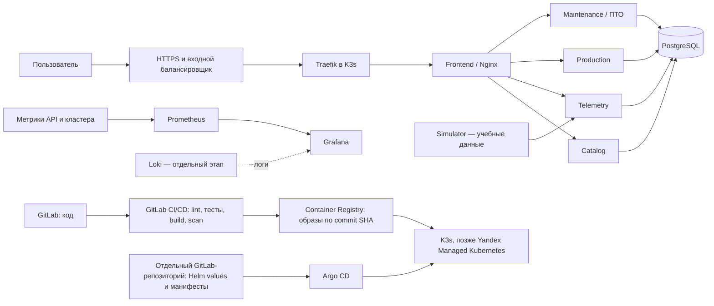

# Завод строительных материалов — учебный DevOps-проект

Учебный стенд для практики разработки и эксплуатации сервиса: цифровая схема завода, показания **симулятора** датчиков, заявки на выпуск и база планового технического обслуживания (ПТО). Данные не подключены к реальным датчикам; проект не является системой управления производственным оборудованием или инструкцией по его обслуживанию.

Главная цель — пройти полный путь изменения: требование → код → проверка → образ → развёртывание из Git → наблюдение → разбор и исправление сбоя. Работаем по шагам: я объясняю задачу и проверку, пользователь сам выполняет команды и принимает решения; автоматические проверки помогают находить ошибки, но не подменяют понимание.

## Где проект сейчас

| Часть | Что уже есть | Что ещё впереди |
|---|---|---|
| Предметная область | Описание площадок в `data/plant.yaml`, схема завода, контракты JSON Schema | Дополнять только согласованными данными; не придумывать паспортные значения оборудования |
| Приложение | `catalog`, `telemetry`, `simulator`; заготовка `production`; MVP сервиса `maintenance`; интерфейс в `frontend` | Проверить сквозной сценарий и заполнение настоящими разрешёнными данными; развивать API КТП отдельно |
| Локальная инфраструктура | Есть конфигурация метрик и дашборды Grafana | Начать контейнеризацию с нуля: подготовить Dockerfile и Compose, затем запускать и проверять на Linux VM |
| CI/CD и GitOps | Подтверждённого рабочего pipeline этого проекта ещё нет | GitLab CI/CD, реестр образов, отдельный репозиторий манифестов, Argo CD |
| Kubernetes и облако | Кластера и Terraform-развёртывания этого проекта ещё нет | Учебный K3s, затем отдельная лаборатория с Yandex Cloud Managed Kubernetes |
| ПТО | Есть реестр оборудования и экран со сроками/работами, PostgreSQL и дашборд ПТО | Проверить бизнес-правила, миграции схемы и восстановление резервной копии |

### Сколько контейнеров планируется

Целевой стартовый Compose-стенд — **10 контейнеров по одному экземпляру**: семь контейнеров приложения (`frontend`, `catalog`, `telemetry`, `production`, `ktp`, `simulator`, `maintenance`) и три вспомогательных (`postgres`, `prometheus`, `grafana`). Сейчас Dockerfile и Compose-конфигурация удалены; контейнеризацию начнём заново по этапам. Это планируемое число, не утверждение, что сервисы уже собраны или запущены.

Количество меняется, когда добавляются инструменты: Loki, Argo CD, Vault, Keycloak и другие компоненты; в K3s часть инструментов сама состоит из нескольких Pod. PostgreSQL в Yandex Cloud будет управляемым сервисом, поэтому его не считаем приложенческим Pod. Traefik для будущего K3s обычно уже включён в K3s; отдельный второй ingress-контроллер без причины не добавляем. Число 10 — учебная отправная точка, а не размер production-кластера.

## Архитектура и путь кода

Это целевая учебная схема, не описание уже работающего развёртывания. Сначала все сервисы запускаются в одном Compose-стенде на Linux VM. Затем те же образы и проверенные настройки переносятся в K3s. Манифесты кластера хранятся отдельно от кода приложения; Argo CD применяет версию из Git, а не получает доступ на изменение кластера из job приложения.

### Семь сервисов приложения

| Сервис | Порт для локальной лаборатории | Ответственность |
|---|---:|---|
| `frontend` | 8080 | Статические страницы и Nginx reverse proxy; один контейнер фронтенда |
| `catalog` | 8081 | Площадки, КТП, связи питания, производственные маршруты |
| `telemetry` | 8082 | API показаний и истории датчиков; сейчас хранилище показаний в памяти |
| `production` | 8083 | Заявки на выпуск и план/факт; сейчас часть данных в памяти |
| `ktp` | 8084 | Будущий API состояния КТП; пока это граница сервиса, не готовая реализация |
| `simulator` | 8085 | Генератор явно учебных, синтетических показаний |
| `maintenance` | 8086 | Реестр оборудования, планы ТО, счётчики наработки и заявки на работы |

## Правила работы: что берём из ревью U Gracha

Это проверенные по живым обсуждениям контрольные правила из MR [!1](https://gitlab.impet.space/u-gracha/evgenii-u-gracha/-/merge_requests/1), [!2](https://gitlab.impet.space/u-gracha/evgenii-u-gracha/-/merge_requests/2) и [!3](https://gitlab.impet.space/u-gracha/evgenii-u-gracha/-/merge_requests/3) проекта U Gracha. Переносим их в наш процесс как конкретные проверки, а не как формальность.

| Урок из сохранённой истории | Как проверяем в этом проекте |
|---|---|
| Не перезапускать красный job без разбора исходной причины | Сначала сохраняем ошибку и лог, устанавливаем причину, исправляем код/runner/configuration, затем запускаем pipeline повторно |
| Не маскировать инфраструктурный сбой под успешную runtime-проверку | Smoke-test запускает Compose, проверяет готовность сервисов, HTTP и нужные тома. Если runner не может запустить Docker daemon, статус явно сообщает, что проверка не выполнена; такой pipeline не называем полностью проверенным |
| Выделять допустимое ограничение runner из ошибки приложения | Известное ограничение — отдельное явное состояние с условием и пояснением; ошибка build, healthcheck, тестов или HTTP остаётся блокирующей |
| Не смешивать ветки и не возвращать уже исправленные ошибки | Следующий MR строится поверх актуального целевого commit; перед ревью проверяем merge-base и весь diff на возврат прежних исправлений. Для серии зависимых MR порядок и целевые ветки явные |
| Делать CI зависимости явными для каждого сервиса | `needs` задаётся отдельно каждому build/publish job: backend публикация обязана ждать backend lint и backend tests, а не унаследовать зависимости frontend из общего шаблона |
| Не подменять registry CI artifacts | Если registry обязателен для доставки, его недоступность должна ломать publish. `.tar` среди временных artifacts не является заменой registry image и не должен превращать pipeline в зелёный |
| Разделять validate и publish | MR pipeline проверяет код и собирает образ без публикации, если review-окружение не требует обратного. Публикацию main проверяем отдельно: credentials, push SHA-тега и последующий pull/digest |
| Доказывать весь путь поставки | Зелёный lint/test/build не доказывает, что publish job вообще выполнялся, а публикация не доказывает deploy. Фиксируем результаты каждого шага отдельно; immutable SHA/digest — идентификатор версии, `latest` не замена |
| Держать pipeline коротким, но понятным | Кэш зависимостей привязываем к lock/requirements-файлам, не к ветке; не устанавливаем одни и те же пакеты без нужды в нескольких стадиях. Общие настройки job — только в нейтральном шаблоне, без скрытых правил и `needs` |
| Учитывать реальные возможности Runner и builder | Сначала выясняем executor и `privileged` для Docker-in-Docker. Не повторяем без изменения конфигурации заведомо невозможный запуск; используем поддерживаемую стратегию сборки с закреплённой версией и digest, не заброшенный builder |
| Проверять runtime, а не только Docker build | Smoke-test запускает образ, проверяет `/health`/`/ready`, команду запуска, пользователя, запись в `/media` и необходимые volumes. Неуспешный или пропущенный тест так и маркируется |
| Фиксировать и контролировать зависимости | Прямые и транзитивные Python-зависимости отражены в lock-файле; уязвимые версии обновляются вместе с lock. Базовые образы pin по версии/digest, образы сканируются на уязвимости |
| Запускать контейнеры с ограниченными правами и безопасной конфигурацией | Не root без причины; корректный exec-form процесс, HEALTHCHECK, проверенные права записи. Секреты — только через secret store/CI variables; localhost-порты ограничены loopback, TLS-проверку и одну понятную схему registry auth не отключаем |
| Выбирать владельца registry и lifecycle заранее | Образы принадлежат проекту/команде, а не личному namespace; задаём retention/cleanup и правила временных MR-образов |
| Делать ревью и документацию проверяемыми | Небольшой сфокусированный MR; статус pipeline и commit SHA в README соответствуют фактическому head. «Собрано» не значит «опубликовано», «опубликовано» не значит «pull подтверждён», а это не значит «развёрнуто» |

Сохранённая история отдельно отмечает конкретный урок: job `smoke_compose` падал на недоступном Docker daemon в Kubernetes Runner. Временный статус со специальным кодом выхода сообщал об ограничении runner, но не подтверждал запуск контейнеров. В нашем проекте переносим саму ясность статуса, а целевое решение — runner/BuildKit, позволяющий выполнить настоящий smoke-test и сделать его обязательным перед поставкой.

## Этапы проекта

Этап заканчивается демонстрацией и короткой записью: цель, команда/действие, ожидаемый результат, что сломалось и как диагностировали. Очередной этап начинаем после понятной проверки предыдущего. Это учебный план; сроки определяем по темпу обучения, а не обещаем календарные даты.

### 0. Безопасная рабочая основа

**Зачем:** не терять изменения и случайно не включить весь профиль Windows в репозиторий.

**Делаем:** выбираем одну Linux lab VM и место репозитория; проверяем `.gitignore`, `.env.example`, границу Git и состояние каталога. До первого push убеждаемся, что корень репозитория ровно `C:\Users\User\smart_factory`, а не профиль `C:\Users\User`. Выбираем один основной remote для CI. Для тренировки списка технологий основной pipeline будет GitLab CI/CD; GitHub можно подключить отдельно как зеркало/портфолио после безопасной настройки remote.

**Готово, когда:** `git rev-parse --show-toplevel` указывает на каталог проекта; статус и список файлов проверены; секретов, виртуального окружения, временных данных и чужих каталогов в индексе нет; понятен способ вернуться на предыдущий коммит.

### 1. Linux и понимание приложения

**Зачем:** уметь установить, где именно ломается путь запроса, до добавления оркестрации.

**Инструменты:** Linux, SSH, `systemd` (позже), `ps`, `top`, `free`, `df`, `vmstat`, `iostat`, `ss`, `journalctl`, `curl`, Python virtualenv.

**Делаем:** запускаем catalog → telemetry → simulator и остальные имеющиеся API отдельными процессами; проверяем health, свежесть показаний, сетевые порты, логи и зависимость от каталогов/production.

**Готово, когда:** пользователь может показать запрос от браузера до API и назад, прочитать лог процесса и объяснить CPU, память, диск и порт без перезапуска наугад.

### 2. Контракты и функциональное ядро

**Зачем:** инфраструктура не спасает сервис, если его данные теряются или контракты расходятся.

**Инструменты:** Python/FastAPI, HTML/JavaScript, JSON Schema, pytest, HTTP-клиент.

**Делаем:** зафиксировать API-контракты; довести одинаковый сценарий заявки до сквозного результата; решить, какие события синтетические. Для ПТО документировать единицы, источник и время счётчика; неизвестные даты последнего обслуживания показывать как неизвестные. Согласованные исходные интервалы: обслуживание оборудования пяти действующих цехов каждые 6 месяцев; КТП ТМГ33-1000/0,4, 1000 кВА — каждые 12 месяцев. Фактические даты и серийные номера не выдумывать.

**Готово, когда:** автоматическая проверка подтверждает контракты и бизнес-сценарии; отдельно показан случай неполных данных; учебные значения видимо помечены.

### 3. Контейнеры и локальная сеть Compose

**Зачем:** воспроизводимо запускать сервисы и проверить фактический состав перед Kubernetes.

**Инструменты:** Docker/BuildKit, Docker Compose, Nginx, непривилегированный пользователь, healthcheck, `.dockerignore`, Docker networks и volumes.

**Делаем:** начать с минимального Dockerfile для frontend, затем создавать отдельный образ для каждого нужного API. Перенести внутренние адреса API на DNS имена Compose, подключить PostgreSQL к maintenance, добавить health/readiness checks и проверку прав постоянного хранилища. Не складывать изменяемые данные в image layer.

**Готово, когда:** `docker compose up` поднимает выбранный сценарий; healthchecks зелёные; UI и API связаны через Compose; после пересоздания контейнера проверены сохранение и восстановление данных. Образы работают с минимальными правами.

**Число:** целевой стартовый Compose — 10 сервисов/контейнеров по одному экземпляру, перечисленных выше. Добавочные observability/security инструменты и реплики в это число не входят.

### 4. PostgreSQL и жизненный цикл данных

**Зачем:** заявки и ТО должны переживать перезапуск процесса и контейнера.

**Инструменты:** PostgreSQL локально в Compose, SQLAlchemy, Alembic, connection pool; позднее Yandex Managed Service for PostgreSQL.

**Делаем:** переводить сохранение заявок и показаний из памяти в PostgreSQL; заменить `create_all` версионируемыми миграциями; добавить индексы и проверку готовности соединения. Отдельно документировать схему миграции и обратную совместимость.

**Готово, когда:** тесты проверяют новую/пустую БД и upgrade; перезапуск процесса не теряет записи; backup восстановлен в отдельную тестовую БД. В облачной лаборатории проверяем автоматические backups Managed PostgreSQL и, отдельно, плановый экспорт `pg_dump` в Object Storage.

### 5. Метрики, дашборды, логи и алерты

**Зачем:** заметить ухудшение до того, как пользователь принесёт скриншот ошибки.

**Инструменты:** Prometheus, Grafana, Alertmanager, Loki; позднее OpenTelemetry Collector и Tempo/Jaeger для traces. Grafana уже включена в Compose, а dashboards и Prometheus scrape config находятся в `infra/observability/`.

**Делаем:** сначала метрики доступности, задержки/ошибок, PostgreSQL и свежести телеметрии; затем dashboard руководителя и ПТО, правила предупреждений, маршрутизацию уведомлений, структурированные логи в Loki и сквозной trace между API. Отдельно тренируем разбор инцидента: время, сигнал, влияние, первопричина, исправление, подтверждающий график.

**Готово, когда:** можно отличить «сервис жив» от «сервис готов к запросу», найти один синтетический инцидент по alert → dashboard → log/trace и показать восстановление.

### 6. GitLab и CI/CD

**Зачем:** каждый merge получает одни и те же автоматические проверки и пригодный образ.

**Инструменты:** Git, GitLab, `.gitlab-ci.yml`, GitLab Runner, Container Registry, BuildKit; Python lint и тесты.

**Делаем по порядку:** pipeline `validate/lint → test → build → scan → publish`. Сначала lint и тесты отдельно по изменённым сервисам, затем сборка с повторным использованием BuildKit/registry cache, сканирование зависимостей и образа, публикация только из доверенной ветки после успешных проверок. Именовать образы полным SHA коммита; выпускать их один раз и продвигать тот же digest между окружениями.

**Smoke-test:** отдельный job использует runner, который может выполнить runtime-проверку Compose без скрытой зависимости от запрещённого `privileged` DinD. Job стартует сервисы, ждёт healthchecks, проверяет HTTP и запись/чтение. Если окружение этого не поддерживает — это видимый пропуск с причиной и открытой задачей на правильный runner, а не ложное подтверждение теста.

**Готово, когда:** намеренно внесённая ошибка останавливает pipeline; публикация зависит от тестов; pull опубликованного SHA/digest подтверждён; кэш ускоряет повторный build; secret scanning не находит секретов; логи ясно отличают успех, ошибку и непроведённую проверку.

### 7. Kubernetes на учебной VM, Helm и Rancher

**Зачем:** освоить Pod, Deployment, Service, DNS, ресурсы и диагностику в маленьком изолированном кластере.

**Инструменты:** K3s на отдельной Linux lab VM, `kubectl`, Helm, YAML, Traefik из комплекта K3s, Rancher для UI управления кластером.

**Делаем:** сначала перенести один stateless сервис; добавить requests/limits, probes, non-root securityContext, ServiceAccount с минимумом прав и NetworkPolicy. Затем API, frontend и Grafana. PostgreSQL и хранилище в учебном кластере — только с явно проверенными PV/PVC, backup/restore и политикой удаления. Traefik обслуживает ingress; не ставить второй экземпляр поверх поставляемого без задачи.

**Готово, когда:** сервис восстанавливается после удаления Pod; DNS/Ingress проверены; вручную созданный drift найден и объяснён; разобраны `Pending`, `CrashLoopBackOff`, неуспешная probe и нехватка ресурсов.

**Rancher и масштабирование:** Rancher помогает наблюдать и управлять кластером, но сам факт регистрации облачного кластера не означает, что Rancher может масштабировать его VM. Масштабирование узлов на Yandex Managed Kubernetes задаётся через node group/Cloud Cluster Autoscaler; отдельно проверяются метрики нагрузки и HPA для Pod. Вид и управление нодами зависят от способа создания кластера.

### 8. GitOps, Helm и стратегия отката

**Зачем:** сделать Git источником желаемого состояния и показывать, какая версия реально работает.

**Инструменты:** второй GitLab-репозиторий `smart_factory-deploy`, Helm chart приложения, values для `dev`, `test`, `prod`, Argo CD.

**Делаем:** хранить chart/манифесты и настройки окружений отдельно от исходников приложения. CI проверяет chart и публикует образ; после одобрения обновляет image digest в deploy-репозитории. Argo CD читает Git и синхронизирует кластер. Для первой лаборатории наблюдаем diff и синхронизируем вручную; затем включаем auto-sync/self-heal. Откат — возвратом предыдущего digest/commit в deploy Git.

**Готово, когда:** изменение из deploy Git доходит в тестовый кластер через Argo CD; ручной drift виден; возврат коммита восстанавливает прежний digest. CI сборки приложения не имеет прав напрямую разворачивать production.

### 9. Terraform и Yandex Cloud

**Зачем:** описать сеть и платформу кодом, показать изменение до оплаты и применять только понятный plan.

**Инструменты:** Terraform и официальный провайдер Yandex Cloud; VPC, private subnets, security groups, service accounts, Managed Kubernetes, node groups, Managed PostgreSQL, Object Storage, ALB/NLB.

**Делаем:** сначала `fmt`, `validate`, `plan` без создания платных ресурсов; затем в отдельном sandbox создать минимальные VPC/subnets/SG и нужные роли. Уточнить бюджет/квоты до `apply`. Секреты и Terraform state не хранить в Git; state backend, блокировка, разграничение доступа и резервирование спланировать отдельно. Никаких боевых адресов/данных.

**Сеть и входящий трафик:** публичный HTTP(S) идёт через Application Load Balancer с TLS; сервисный TCP-трафик — через отдельную схему с Network Load Balancer только при обоснованном протоколе/источнике. Traefik внутри Kubernetes отвечает за маршрутизацию до Service. Решение, где завершается TLS и как ALB направляет трафик к Traefik, фиксируется на схеме и проверяется на тестовом домене до создания второго балансировщика.

**Готово, когда:** Terraform показывает ожидаемую сеть и ресурсы; правила security groups минимальны; `plan` ревьюится; sandbox создаётся и удаляется воспроизводимо; расходы можно увидеть; CI не имеет широкого постоянного cloud key.

### 10. Облачная база и резервное копирование

**Зачем:** проверить не только создание сервиса, но и возврат данных после ошибки.

**Инструменты:** Managed Service for PostgreSQL, Object Storage, `pg_dump`/`pg_restore`, расписание и уведомление о результате.

**Делаем:** сравнить штатные managed backups/PITR и отдельный зашифрованный экспорт в Object Storage; определить срок хранения и доступ к bucket; записать восстановление в чистый тестовый кластер. Backup считается полезным только после успешного restore.

**Готово, когда:** тест восстановления завершён и измерены время и полнота; определены учебные RPO/RTO; проверены ошибки доступа, недостатка места и провалившегося расписания.

### 11. Секреты, права и единый вход

**Зачем:** дать пользователям и сервисам только нужный доступ и иметь управляемую ротацию.

**Инструменты:** Kubernetes RBAC, NetworkPolicy, HashiCorp Vault, Vault Kubernetes auth/External Secrets Operator, TLS; Keycloak/OIDC и LDAP только для отдельной лаборатории SSO.

**Делаем:** сначала вынести пароли и токены из файлов/CI logs; затем выдать Pod short-lived identity и минимальную Vault policy; проверить ротацию. Позже подключить Keycloak к тестовому приложению через OIDC и демонстрационному LDAP; реальные рабочие каталоги/учётные записи не использовать.

**Готово, когда:** чистый поиск репозитория и логов не находит секретов, приложения читают только свои пути Vault, неверная роль получает отказ, сертификат проверяется, тестовая ротация не ломает другой сервис.

### 12. Финальные операционные практики

**Зачем:** закрепить ежедневные навыки DevOps, а не только собрать список технологий.

**Инструменты:** Ansible, Bash/Python, runbooks, Alertmanager, Grafana/Loki/traces, review и incident reports.

**Делаем:** Ansible готовит чистую lab VM; Python-утилита безопасно проверяет health всех endpoint; дежурный сценарий проводит alert → диагностика → исправление → rollback/restore → postmortem. Kafka/очередь добавляется только если появилась конкретная потребность в событиях; иначе практику изучаем на отдельном одноразовом стенде.

**Готово, когда:** другой человек по инструкции запускает стенд, воспроизводит сценарий сбоя и восстанавливается без скрытых ручных правок.

## Карта двадцати тем ИПР

Это порядок учебных лабораторий, а не обещание закончить за двадцать календарных дней. Каждый день: сначала предсказываем результат, потом выполняем одну проверку, объясняем вывод и записываем короткий runbook в `docs/labs/`.

| День | Навык | Практический результат на проекте |
|---:|---|---|
| 1 | Linux: процессы, load average, I/O | Baseline CPU/process/disk и разбор высокой нагрузки |
| 2 | Linux: память, page cache, swap, OOM | Ограниченная учебная нагрузка, объяснение OOM и безопасных лимитов |
| 3 | Docker internals, namespaces, cgroups, layers | Объяснить изоляцию, файловые слои и код завершения контейнера |
| 4 | Kubernetes: control plane и worker | Один Pod/Deployment; маршрут `kubectl apply` до контейнера |
| 5 | Контроль Linux/Docker/K8s internals | Troubleshooting минимум двух учебных неисправностей |
| 6 | Kubernetes network, DNS, Service, Ingress | Диагностика запроса и сетевой политики; Traefik в K3s |
| 7 | PV/PVC/CSI и состояние | Пересоздать сервис и проверить данные/restore |
| 8 | GitOps, Argo CD, sync/drift | Изменить Git, синхронизировать приложение, обнаружить drift |
| 9 | Kubernetes security, RBAC, policy | Ограничить ServiceAccount, capabilities и сетевые пути |
| 10 | Контроль сети, storage и GitOps | Диагностика недоступного Service, PVC и рассинхронизации |
| 11 | GitLab CI/CD и Docker caching | Lint → tests → build/scan/publish; повторно использовать BuildKit cache |
| 12 | Terraform, state и review | Сеть Yandex Cloud описана кодом; изучен plan без неожиданного apply |
| 13 | PostgreSQL, миграции и backup | Перевести заявки с памяти, создать миграцию и доказать restore |
| 14 | Kafka и надёжность событий | Изолированная lab producer/consumer, retries и lag; Kafka в приложение только по необходимости |
| 15 | Контроль CI/IaC/БД/событий | Объяснить pipeline, восстановить базу, диагностировать учебный lock/error |
| 16 | Prometheus/Grafana/Alertmanager/SLO | Заводской и ПТО dashboards, проверенный alert и свежесть показаний |
| 17 | OpenTelemetry и Loki | Сквозной trace и связанный структурированный лог в Loki |
| 18 | Vault, PKI и Keycloak/LDAP | Безопасное получение секрета и тестовый OIDC/LDAP-вход |
| 19 | RTO/RPO, DR и безопасное нарушение работы | Восстановить backup; остановить только лабораторный Pod и разобрать деградацию |
| 20 | Итоговая защита | Показать изменение от GitLab CI до Argo CD, метрик, logs, trace и rollback |

## Разделение публичного и внутреннего трафика

- **Application Load Balancer:** входной HTTPS для пользовательского сайта и разрешённого публичного API; терминатор TLS и health checks.
- **Traefik:** ingress внутри K3s; правила, маршруты, таймауты и проверки приложения.
- **Network Load Balancer:** отдельный Layer 4 вход для согласованной служебной TCP/UDP-интеграции, если такая интеграция появится.
- **Nginx:** остаётся внутри frontend-контейнера для статики и reverse proxy. Kubernetes ingress-NGINX не выбираем для нового стенда: upstream Kubernetes Ingress NGINX был выведен из поддержки в марте 2026 года. [Заявление Kubernetes](https://kubernetes.io/blog/2026/01/29/ingress-nginx-statement/).

Схема «ALB + NLB» — упражнение по сравнению уровней балансировки, а не обязательная платная конфигурация текущей локальной лаборатории.

## Отдельный сквозной блок ПТО

Реестр должен хранить идентификатор и площадку оборудования, тип/модель, источник регламента, интервалы по дате и/или моточасам, исходное и текущее показание счётчика, дату последней и следующей работы, исполнителя, простой, запчасти и историю статусов. Снижающееся/устаревшее показание не должно незаметно двигать срок ТО. Статусы `ok`, `due_soon`, `overdue`, `unknown` различаются; без фактической даты последнего обслуживания нельзя придумывать срок.

**Готово для MVP ПТО, когда:** можно внести актив, план, показание и рабочую заявку; системе удаётся рассчитать следующий срок; журнал не теряет историю; UI и Grafana согласованы; PostgreSQL мигрируется и восстанавливается; пароль ПТО не хранится в открытом Git. Производственные интервалы подтверждаются паспортом или ответственным специалистом.

## Рабочий ритм и критерий завершения этапа

1. Выбираем одну маленькую задачу и заранее объясняем, чему она учит из списка ИПР.
2. Сначала читаем текущую конфигурацию и воспроизводим состояние; реальные ошибки сохраняем вместе с достаточным контекстом.
3. Вносим одну логически законченную порцию изменений, запускаем подходящие lint/test/health/smoke checks.
4. Сверяем ожидаемый и фактический результат; если проверка не запускалась, пишем об этом явно.
5. Документируем команду, результат, известное ограничение и обратимый способ отката; только после этого переходим дальше.

Этап считается закрытым, когда есть читаемый diff, пройденные проверки или честно отмеченное внешнее ограничение, короткое объяснение решения и демонстрация работающего сценария. Ветка CI зелёная с пропущенной runtime-проверкой не называется полностью проверенной.

## Контейнеризация пока не настроена

Dockerfile, `.dockerignore` и Docker Compose удалены, чтобы начать этот этап с чистого листа и разобрать каждый шаг самостоятельно. Исходный код приложения, Nginx-конфигурация frontend и настройки метрик сохранены. Следующая задача этого этапа — спроектировать и создать первый минимальный Dockerfile для frontend, а затем добавить Compose после проверки образа.

## Безопасность и стоимость

- Реальные `.env`, токены GitLab/Cloud, Terraform state, ключи Vault и пароли в Git не добавляются.
- Учебные сбои, синтетические датчики и примерные данные всегда отмечены; никаких команд управления реальными КТП/двигателями.
- Перед любым облачным `apply` сначала проверяем регион, квоту и прогноз стоимости; учимся с минимального sandbox и удаляем ресурсы после упражнения.
- Не делать настоящие атаки, нагрузку на публичную инфраструктуру, ручное редактирование боевого кластера или destructive `terraform apply/destroy` без проверки plan и цели.
- На старте избегаем HA, нескольких окружений в облаке, Kafka, двух ingress-контроллеров и продакшен SSO одновременно: каждую технологию добавляем там, где есть конкретная проверяемая задача.

## Официальные справочники технологий

- [Yandex Managed Kubernetes: автоматическое масштабирование](https://yandex.cloud/en/docs/managed-kubernetes/operations/autoscale) — autoscaling задаётся для node group; отдельно существуют cluster, HPA и VPA.
- [Yandex Cloud Terraform: Kubernetes node group](https://yandex.cloud/en/docs/terraform/resources/kubernetes_node_group) — схема ресурса и autoscale policy.
- [K3s networking services](https://docs.k3s.io/networking/networking-services) — K3s по умолчанию ставит Traefik; конфигурацию packaged component задают поддерживаемым способом.
- [GitLab CI: BuildKit](https://docs.gitlab.com/ci/docker/using_buildkit/) и [кэш слоёв Docker](https://docs.gitlab.com/ci/docker/docker_layer_caching/) — варианты сборки и повторного использования cache.
- [Argo CD: automated sync](https://argo-cd.readthedocs.io/en/stable/user-guide/auto_sync/) — кластер синхронизируется из желаемого состояния в Git.
- [Yandex Managed PostgreSQL: резервные копии](https://yandex.cloud/en/docs/managed-postgresql/concepts/backup) — встроенные backups/PITR; отдельный экспорт в Object Storage всё равно нужно спроектировать и проверить restore.
- [HashiCorp Vault Kubernetes auth](https://developer.hashicorp.com/vault/docs/auth/kubernetes) и [Keycloak LDAP federation](https://www.keycloak.org/docs/latest/server_admin/index.html) — поздние практикумы по секретам и тестовой федерации пользователей.

## Источник материалов и открытые пункты

- Требования к навыкам взяты из перечня пользователя: Yandex Cloud, Terraform, Managed Kubernetes/PostgreSQL, Object Storage, ALB/NLB, K8s/Helm, Traefik/Nginx, Argo CD/GitOps, GitLab CI/CD, Prometheus/Grafana/Loki, Vault, PostgreSQL, Docker, Python, Ansible, Rancher и Keycloak/LDAP.
- Маршрут из 20 учебных тем сопоставлен с имеющимся `docs/ipr-roadmap.md`; это план обучения, не отметка, что эти работы уже выполнены.
- Практические уроки проверены по live discussions MR [!1](https://gitlab.impet.space/u-gracha/evgenii-u-gracha/-/merge_requests/1), [!2](https://gitlab.impet.space/u-gracha/evgenii-u-gracha/-/merge_requests/2) и [!3](https://gitlab.impet.space/u-gracha/evgenii-u-gracha/-/merge_requests/3). В частности, MR !3 выявил критичную ошибку наследования `needs`: публикация backend могла не ждать backend-тесты; после исправления проверка фактического main push/pull всё ещё отмечалась отдельным незавершённым доказательством в обсуждении. В проекте Smart Factory эти выводы превращены в критерии этапов и CI.
- Каталог исходного оборудования: [`data/plant.yaml`](data/plant.yaml); схема: [`docs/plant-scheme.png`](docs/plant-scheme.png); API: [`packages/contracts`](packages/contracts); метрики и Grafana: [`infra/observability/`](infra/observability/); подробности ПТО: [`services/maintenance/README.md`](services/maintenance/README.md).

Устаревший план в `docs/ipr-roadmap.md` заменён ссылкой на этот README, чтобы не расходились ветка CI, кластер и статусы реализации.
